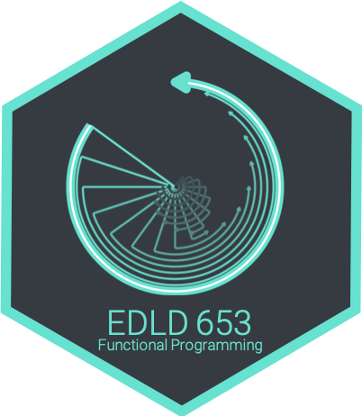
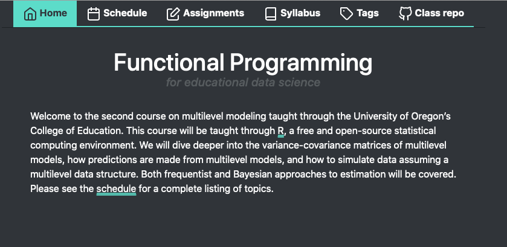

```{r include = FALSE, results = "asis"}
source(here::here("static", "slides", "slide-setup.R"))
xaringanExtra::use_clipboard()
knitr::opts_chunk$set(
  warning = FALSE,
  message = FALSE
)
```

`r setup("w1")`

---

# Agenda 

.pull-left[

* Getting on the same page

* Syllabus

* Intro to data types

]


.pull-right[

.right[

```{r fig.asp = 1.3333, echo = FALSE}

```

]

]

---
background-image: url(https://images.pexels.com/photos/1005324/literature-book-open-pages-1005324.jpeg?auto=compress&cs=tinysrgb&dpr=2&h=650&w=940)
class: inverse bottom
background-size:cover

# Getting on the same page

---
# Introduce yourself!

* We mostly know each other, but it's always good to hear from each other.

* Tell us why you're taking the class 

* What's one fun thing you've done recently outside of school stuff?

* What pronouns would you like us to use for you in this class?

---
# This term for me

* Full-time employed with [Abl](https://www.ablschools.com/) starting next week.

* This is my only UO responsibilities

* Doesn't mean I'm less committed to you

* Does mean time is going to be tricky

  + Friday afternoons will be best for meetings - can do evenings too if needed.

---
background-image: url(https://akm-img-a-in.tosshub.com/indiatoday/images/story/201802/Syllabus-featured.jpeg?rpmIvNBBqGMDT7lPG.Qe4AzWs6OfDh9K)
class: inverse bottom
background-size:cover

# Syllabus

---
# Course Website(s)



---
# Course learning objectives

* Understand and be able to describe the differences in R's data structures and when each is most appropriate for a given task


--
* Explore `purrr::map` and its variants, how they relate to base R functions, and why the {purrr} variants are often preferable.


--
* Work with lists and list columns using `purrr::nest` and `purrr:unnest`


--
.gray[

* Understand how `dplyr::rowwise()` can help you avoid some of the above

]


---
# Course learning objectives


* Convert repetitive tasks into functions 


--
* Understand elements of good functions, and things to avoid


--
* Write effective and clear functions with the mantra of "Don't Repeat Yourself"

---
# This Week's learning objectives

* Understand the requirements of the course

--

* Understand the requirements of the final project

--

* Understand the fundamental difference between lists and atomic vectors


--
* Understand how atomic vectors are coerced, implicitly or explicitly


--
* Understand various ways to subset vectors, and how subsetting differs for lists


--
* Understand attributes and how to set/modify


---
class: inverse-blue middle
# Textbooks

---
background-image:url(https://d33wubrfki0l68.cloudfront.net/565916198b0be51bf88b36f94b80c7ea67cafe7c/7f70b/cover.png)
background-size:contain
class: middle

.right[
[Link](https://adv-r.hadley.nz)
]

---
# Other books (also free)

.pull-left[
[Bryan](http://happygitwithr.com)
<div>
 </div>
]

.pull-right[
[Wickham & Grolemund](https://r4ds.had.co.nz)
<div>
 </div>

]

---
# Structure of the course

* First 5 weeks - mostly iteration

  + Data types
  + Base R iterations
  + {purrr}
  + Batch processes and working with list columns
  + Parallel iterations (and a few extras)


--
* Second  5 weeks - Writing functions and shiny
  + Writing functions 1-3
  + Shiny 1-3

---
# Labs
### 15%
### 3 @ 10 points each

Two labs on iteration and one on functions.

If possible - please try to be in-class on Lab days. I understand this is not always possible, but it helps me help you.

```{r echo = FALSE, message = FALSE}
library(tidyverse)
library(lubridate)

labs <- tibble(
  Lab = 1:3,
  `Date Assigned` = mdy(c("4/4/22", "4/11/22", "5/9/22")),
  `Date Due` = mdy(c("4/11/22", "4/18/22", "5/16/22")),
  Topic = c("Subsetting lists and base R `for()` loops",
            "Multiple models and API calls with **{purrr}**",
            "Create and apply functions")
) %>% 
  mutate(across(where(is.Date), ~format(.x, "%a, %B %d")))

knitr::kable(labs)
```


---
# Midterm
### 70 points total (35%)
Two parts: 
* Small quiz on canvas to demonstrate knowledge (4/22; 10 points)
  + Identifying bugs in code
  + Multiple choice/fill-in the blank questions
  + Free response
  
* Take-home portion to demonstrate ability to write the correct code (assigned 4/22; 60 points)
  + Write loops to solve problems


---
# Take home midterm

* Group project: 3-5 people

* Shared GitHub repo

* Divide it up to ease the workload, then just check each other's work

--

Already <a href="../take-home-midterm" target="_blank">posted</a>!

---
# Final Project 
### 100 points total (60%)

5 parts

|  **Component** |**Due**  | **Points** | **Percentage of final grade**  |
|  :---------------- | :------  |:--:|:--:|
|  Groups finalized  | 04-04-22 | 0  | 0  |
|  [Outline](https://fp-2022.netlify.app/assignments/#outline) | 04-18-22 | 5  | 2.5|
|  [Draft data script](https://fp-2022.netlify.app/assignments/#draft-data-preparation-script) | 05-16-22 | 10 | 5  |
|  [Peer Review](https://fp-2022.netlify.app/assignments/#peer-review) | 05-23-22 | 15 | 7.5|
|  [Final Product](https://fp-2022.netlify.app/assignments/#final-product) | 06-06-22 | 70 | 35 |
---
class: inverse-red middle
# What is it?
## Two basic options

---
# Data Product 
Similar to first class

* Brief research manuscript (can be APA or not, I don't really care 🤷‍♂️)

* Shiny app

* Dashboard
  + Probably unlikely to work well though, unless you make it a shiny dashboard

* Blog post

* For the ambitious - a documented R package

---
# Tutorial
* Probably best done through a blog post or series of blog posts

* Approach as if you're teaching others about the content I'll ask you to cover

* BONUS: You can actually release the blog post(s) and may get some traffic 🎉👏🥳


---
background-image:url(https://images.pexels.com/photos/1252869/pexels-photo-1252869.jpeg?auto=compress&cs=tinysrgb&dpr=2&h=750&w=1260)
background-size:cover
class:inverse center middle

# Make it your own


---
# What you have to have
* Everything on GitHub

* Publicly available dataset

* Team of 2-5

---
# What you have to cover
Unfortunately, this still is a class assignment. I have to be able to evaluate
that you can actually apply the content within a messy, real-world setting.


--
The grading criteria (which follow) may force you into some use cases that are 
a bit artificial. This is okay.


---
# Grading criteria

* No code is used repetitively (no more than twice) .gray[10 points]


--
* More than one variant of `purrr::map` is used .gray[5 points]


--
* At least one {purrr} function outside the basic `map` family (`walk_*`, 
`reduce`, `modify_*`, etc.) .gray[5 points]


--
* At least one instance of parallel iteration (e.g., `map2_*`, `pmap_*`) .gray[5 points]


--
* At least one use case of `purrr::nest %>% mutate()` .gray[5 points]

---
# Grading criteria

* At least two custom functions .gray[20 points; 10 points each]

  + Each function must do exactly one thing
  + The functions **may** replicate the behavior of a base function - as noted above this is about practicing the skills you learn in class


--
* Code is fully reproducible and housed on GitHub .gray[10 points]


--
* No obvious errors in chosen output format .gray[5 points]


--
* Deployed on the web and shareable through a link .gray[5 points]

---
# Outline
### Due 4/18/21

Four components:
* Description of data source (must be publicly available)

* Purpose (tutorial or substantive)

* Chosen format

* Lingering questions
  + How can I help?


--
Please include all components - including the question(s) section!

---
# Draft
### Due 5/16/21, before class
* Expected to still be a work in progress

  + This means some of your code may be rough and/or incomplete. However:

* Direction should be obvious

* Most, if not all, grading elements should be present

* Provided to your peers so they can learn from you as much as you can learn 
  from their feedback

---
# Peer Review
* Exact same process we've used before

* If, during your peer review, you find grading elements not present,
definitely note them


---
# Utilizing GitHub (required)
* You'll be assigned two groups to review 

* Fork their repo

* Embed comments, suggest changes to their code
  + Please do both of these

* Submit a PR
  
  + Summarize your overall review in the PR


---
# Grading
200 points total

* 3 labs at 10 points each (30 points; 15%) 

* Midterm in-class (10 points; 5%)

* Midterm take-home (60 points; 30%)

* Final Project (100 points; 50%)

  + Outline (5 points; 2.5%)

  + Draft (10 points; 5%)

  + Peer review (15 points; 7.5%)

  + Product (70 points; 35%)


---
# Grading

|  **Lower percent** |**Lower point range**  | **Grade** | **Upper point range**  | **Upper percent**|
|  :-------- | :-----------------| :--| ----------------: | -----:|
|  0.970+    | (194 pts or more) | A+ |                   |       |
|  0.930     | (186 pts)         | A  | (193 pts)         | 0.969 |
|  0.900     | (180 pts)         | A- | (185 pts)         | 0.929 |
|  0.870     | (174 pts)         | B+ | (179 pts)         | 0.899 |
|  0.830     | (166 pts)         | B  | (173 pts)         | 0.869 |
|  0.800     | (160 pts)         | B- | (165 pts)         | 0.829 |
|  0.770     | (154 pts)         | C+ | (159 pts)         | 0.799 |
|  0.730     | (146 pts)         | C  | (153 pts)         | 0.769 |
|  0.700     | (140 pts)         | C- | (145 pts)         | 0.739 |
|            |                   | F  | (139 pts or less) | 0.699 |

---
class: inverse
background-image:url(https://d194ip2226q57d.cloudfront.net/original_images/10_Tips_for_Workplace_Communication)
background-size:contain

---
class: inverse-blue center middle
# Break

`r countdown::countdown(minutes = 5, color_background = "#ffffff")`

---
class: inverse-red center middle
# Basic data types

---
# Vectors
### Pop quiz
Discuss in small breakout groups
* What are the four basic types of atomic vectors?

* What function creates a vector?

* **T**/**F**: A list (an R list) is not a vector.

* What is the fundamental difference between a matrix and a data frame?

* What does *coercion* mean, and when does it come into play?

`r countdown::countdown(minutes = 5, top = 0)`

---
# Vector types
### 4 basic types
Note there are two others (complex and raw), but we almost never care about them.

* Integer

* Double

* Logical

* Character


--
Integer and double vectors are both numeric.

---
# Creating vectors

Vectors are created with `c`. Below are examples of each of the four main types
of vectors.

```{r vector-types}
# L explicitly an integer, not double
integer <- c(5L, 7L, 3L, 94L) 
double <- c(3.27, 8.41, Inf, -Inf)
logical <- c(TRUE, TRUE, TRUE, FALSE, TRUE, FALSE, FALSE)
character <- c("red", "orange", "yellow", "green", "blue", 
               "violet", "rainbow")
```

---
# Coercion
* Vectors **must** be of the same type. 

* If you try to mix types, implicit coercion will occur

* Implicit coercion defaults to the most flexible type
  + which is... ?

--

.pull-left[
```{r }
c(7L, 3.25)
c(3.24, TRUE, "April")
```
]


.pull-right[
```{r }
c(TRUE, 5)
```
]


---
# Explicit coercion
* You can alternatively define the coercion to occur

```{r exp-coercion}
as.integer(c(7L, 3.25))
as.logical(c(3.24, TRUE, "April"))
as.character(c(TRUE, 5)) # still maybe a bit unexpected?
```

---
# Checking types

* Use `typeof` to verify the type of vector

```{r typeof}
typeof(c(7L, 3.25))
typeof(as.integer(c(7L, 3.25)))
```


---
# Coercing to logical

```{r }
as.logical(c(0, 1, 1, 0))
```


--
Any number that is not zero gets coerced to `FALSE`

```{r }
as.logical(c(0, 5L, 7.4, -1.6, 0))
```


--
Wait... why the `NA` here?

```{r }
as.logical(c(3.24, TRUE, "April"))
```

---
# Piping
* Although traditionally used within the tidyverse (not what we're doing here),
it can still be useful. The following are equivalent

```{r pipe, message = FALSE}
library(magrittr)

typeof(as.integer(c(7L, 3.25)))

c(7L, 3.25) %>%
  as.integer() %>%
  typeof()
```

---
# Don't actually need magrittr

## Base pipe! |>

This is a bigger topic than I want to get into here, but for reference...

```{r }
c(7L, 3.25) |>
  as.integer() |>
  typeof()
```

---
# Pop quiz
Without actually running the code, predict which type each of
the following will coerce to.

```{r imp-coerce2-echo, eval = FALSE}
c(1.25, TRUE, 4L)
c(1L, FALSE)
c(7L, 6.23, "eight")
c(TRUE, 1L, 0L, "False")

```

`r countdown::countdown(minutes = 1)`
---
# Answers

```{r imp-coerce2-eval}
typeof(c(1.25, TRUE, 4L))
typeof(c(1L, FALSE))
typeof(c(7L, 6.23, "eight"))
typeof(c(TRUE, 1L, 0L, "False"))
```

---
# Lists
* Lists are vectors, but not *atomic* vectors

* Fundamental difference - each element can be a different type

```{r }
list("a", 7L, 3.25, TRUE)
```

---
# Lists

.pull-left[

* Each element of the list is another vector, possibly atomic, possibly not

* The prior example included all *scalar* vectors

* Lists do not require all elements to be the same length

]


.pull-right[

```{r }
list(
  c("a", "b", "c"),
  rnorm(5),
  c(7L, 2L),
  c(TRUE, TRUE, FALSE, TRUE)
)
```
]

---
# Summary
* Atomic vectors must all be the same type

  + implicit coercion occurs if not (and you haven't specified the coercion explicitly)

* Lists are also vectors, but not atomic vectors
  
  + Each element can be of a different type and length

  + Incredibly flexible, but often a little more difficult to get the hang of

---
# Challenge

### Work with a partner
One of you share your screen: 
* Create four atomic vectors, one for each of the fundamental types

* Combine two or more of the vectors. Predict the implicit coercion of each.

* Apply explicit coercions, and predict the output for each.

(basically quiz each other)

`r countdown::countdown(minutes = 5)`

---
class: inverse-blue middle
# Attributes

---
# Attributes
* What are attributes?


--
  + metadata... what's metadata?


--
  + Data about the data


---
# Other data types

Atomic vectors by themselves make up only a small fraction of the total number of data types in R


--
### What are some other data types?

--
* Data frames 

--
* Matrices & arrays 

--
* Factors 

--
* Dates 


--
Remember, atomic vectors are the atoms of R. Many other data structures are
built from atomic vectors. 

* We use attributes to create other data types from atomic vectors

---
# Attributes

### Common
* Names
* Dimensions

### Less common
* Arbitrary metadata


---
# Examples
### Please follow along!
* See **all** attributes associated with a give object with `attributes`

```{r attributes-iris}
library(palmerpenguins)
attributes(penguins[1:50, ]) # limiting rows just for slides
```

---
```{r iris-head}
head(penguins)
```

---
# Get specific attribute
* Access just a single attribute by naming it within `attr`

```{r iris-class}
attr(penguins, "class")
attr(penguins, "names")
```


--
Note - this is not generally how you would pull these attributes. Rather, you would use `class()` and `names()`. 

---
# Be specific
* Note in the prior slides, I'm asking for attributes on the entire data frame. 

* Is that what I want?... maybe. But the individual vectors may have attributes as well

--
```{r attr-species}
attributes(penguins$species)
attributes(penguins$bill_length_mm)
```


---
# Set attributes
* Just redefine them within `attr`

```{r attr-redefine}
attr(penguins$species, "levels") <- c("Big one", 
                                      "Little one", 
                                      "Funny one")

head(penguins)
```

Note - you would generally not define levels this way either, but it is a general method for modifying attributes.

---
# Dimensions

* Let's create a matrix (please do it with me)

```{r mat1}
m <- matrix(1:6, ncol = 2)
m
```

* Notice how the matrix fills

--
* Check out the attributes

```{r mat1-attributes}
attributes(m)
```

---
# Modify the attributes
* Let's change it to a 2 x 3 matrix, instead of 3 x 2 (you try first)

--
```{r mat1-modify-attr}
attr(m, "dim") <- c(2, 3)
m
```

--
* is this the result you expected?

---
# Alternative creation
* Create an atomic vector, assign a dimension attribute

```{r v-to-m}
v <- 1:6
v
attr(v, "dim") <- c(3, 2)
v
```


---
# Aside
* What if we wanted it to fill by row?

.pull-left[
```{r by-row1}
matrix(6:13, 
       ncol = 2, 
       byrow = TRUE) #<<
vect <- 6:13
dim(vect) <- c(2, 4)
vect
```
]

.pull-right[
```{r by-row2}
t(vect)
```
]

---
# Names
* The following (this slide and the next) are equivalent 

```{r dimnames1}
dim_names <- list(
    c("the first", "second", "III"),
    c("index", "value")
  )

attr(v, "dimnames") <- dim_names
  
v
```

---
# Names

```{r dimnames2}
v2 <- 1:6
attr(v2, "dim") <- c(3, 2)
rownames(v2) <- c("the first", "second", "III")
colnames(v2) <- c("index", "value")
v2
```

---
# Arbitrary metadata

```{r }
attr(v, "matrix_mean") <- mean(v)
v
attr(v, "matrix_mean")
```

* Note that *anything* can be stored as an attribute (including matrices or data frames, etc.)

---
# Why would we do this?

This is a short example that is based on a real example

* Imagine we're accessing a database that has many years of data

* The tables in the database are the same, but the values (of course) differ

* We might want to return the data, but store the year as an attribute


--
This example is overly complicated for the first day, but it will give you an idea of what we're building toward.

---
# Made up db
I'm using a list to mimic a database

```{r }
db <- list(
  data.frame(
    color = c("red", "orange", "green"),
    transparency = c(0.80, 0.65, 0.93)
  ),
  data.frame(
    color = c("blue", "pink", "cyan"),
    transparency = c(0.40, 0.35, 0.87)
  )
)
```

---
```{r }
db
```

---
# Write a function
Let's write a function that grabs one of these tables. If it's "1920" we'll grab the first one, otherwise we'll grab the second one.

```{r }
pull_color_data <- function(year) {
  to_pull <- if(year == "1920") {
    out <- db[[1]]
  } else {
    out <- db[[2]]
  }
  out
}
```

---
# Does it work?

.pull-left[

```{r }
pull_color_data(1920)
pull_color_data(2021)
pull_color_data(2122)
```

]


--

.pull-right[
## Yes!
]
---
# Build a second function

Let's say we want to make a second function that does something with the previous output.

--
## BUT

--
What we do with it is going to depend on the data frame we get back.


--
We need to know the year.


--
Modify our original function to store the year as an attribute!

---
Notice we redefine the attributes so we're including all the prior attributes it already had.
```{r }
pull_color_data <- function(year) {
  to_pull <- if(year == "1920") {
    out <- db[[1]]
  } else {
    out <- db[[2]]
  }
  attributes(out) <- c( #<<
    attributes(out), #<<
    db = year #<<
  ) #<<
  out
}
```

---
# Try

```{r }
pull_color_data(1920)
attr(pull_color_data(2021), "db")
```

---
# Build our second function

Now, we can make our second function, and have it do something different depending on the data that is passed to it.

--
```{r label, options}
print_colors <- function(color_data) {
  title <- paste0("Colors for ", attr(color_data, "db")) 
  colorspace::swatchplot(color_data$color)
  mtext(title) # base plotting function
}
```


---
```{r }
pull_color_data(1920) %>% 
  print_colors()
```

---
```{r }
pull_color_data(2021) %>% 
  print_colors()
```

---
# Another example
Fit a multilevel model and pull the variance-covariance matrix

```{r }
m <- lme4::lmer(Reaction ~ 1 + Days + (1 + Days|Subject), 
                data = lme4::sleepstudy)

lme4::VarCorr(m)$Subject
```

---
# Matrices vs Data frames

Usually we want to work with data frames because they represent our data better.

Sometimes a matrix is more efficient because you can operate on the **entire** matrix at once.

```{r }
set.seed(42)
m <- matrix(rnorm(100, 200, 10), ncol = 10)
m
```

---
```{r }
sum(m)
mean(m)
rowSums(m)
colSums(m)

# standardize the matrix
z <- (m - mean(m)) / sd(m)
```

---
```{r }
z
```

---
# Stripping attributes
* Many operations will strip attributes (which makes storing important things in them a bit precarious)

.pull-left[
```{r stripped1}
v
rowSums(v)
```
]

--
.pull-right[
```{r stripped2}
attributes(rowSums(v))
```

* Generally `names` are maintained

* Sometimes, `dim` is maintained, sometimes not 

* All else is stripped

]

---
# More on `names`

* The `names` attribute corresponds to the individual elements within a vector

```{r names1}
names(v)
names(v) <- letters[1:6]
v
```

---
* Perhaps more straightforward

```{r names2}
v3a <- c(a = 5, b = 7, c = 12)
v3a
names(v3a)
attributes(v3a)
```

---
# Alternatives

```{r names3}
v3b <- c(5, 7, 12)
names(v3b) <- c("a", "b", "c")
v3b

v3c <- setNames(c(5, 7, 12), c("a", "b", "c"))
v3c
```


--
* Note that `names` is **not** the same thing as `colnames`, but, somewhat confusingly, both work to rename the variables (columns) of a data frame. We'll talk more about why this is momentarily.


---
# Why names might be helpful

```{r}
v
```

.pull-left[
```{r}
v["b"]
```
]

.pull-right[
```{r }
v["e"]
```
]

---
# Implementation of factors

```{r factor}
fct <- factor(c("a", "a", "b", "c"))
typeof(fct)
attributes(fct)
str(fct)
```

---
# More manually

```{r }
# First create integer vector
int <- c(1L, 1L, 2L, 3L, 1L, 3L)

# assign some levels
attr(int, "levels") <- c("red", "green", "blue")

# change the class to a factor
class(int) <- "factor"

int
```

---
# This can make things tricky

```{r }
age <- factor(sample(c("baby", 1:10), 100, replace = TRUE))
str(age)
age
```

What if we wanted to convert this to numeric?

---
```{r }
data.frame(age) %>% 
  count(age) %>% 
  mutate(age_numeric = as.numeric(age)) %>% 
  select(starts_with("age"), n)
```

--
These are the integers associated with the factor levels, so `as.numeric()` will not give us the results we want.

---
# Fix

First convert to character, then to numeric (you can ignore the warning in this case)


```{r }
data.frame(age) %>% 
  mutate(
    age_chr = as.character(age),
    age_num = ifelse(age_chr == "baby", 0, as.numeric(age_chr))
  ) %>% 
  count(age, age_chr, age_num)
```


---
# Implementation of dates

```{r dates}
date <- Sys.Date()
typeof(date)
attributes(date)
attributes(date) <- NULL
date
```

* This number represents the days passed since January 1, 1970, known as the Unix epoch.

---
# A bit more on classes
Why do these all print different things?


.pull-left[
```{r }
summary(mtcars[, 1:2])
summary(gss_cat$marital)
```
]

.pull-right[
```{r }
m <- lm(mpg ~ cyl, mtcars)
summary(m)
```
]


---
# What are the classes?

```{r }
class(mtcars[, 1:2])
class(gss_cat$marital)
class(m)
```

---
# S3 methods

When you call `summary()`, it looks for a method (function) for that specific class.


--
`summary(mtcars[, 1:2])` becomes `summary.data.frame(mtcars[, 1:2])`


--
`summary(gss_cat$marital)` becomes `summary.factor(gss_cat$marital)`


--
`summary(m)` becomes `summary.lm(m)`


---
# Naming function

Because S3 is so common in R, I recommend against including dots in function names.


--
`summary.data.frame()` is less clear than it would be if it were `summary.data_frame()`


--
Classes and methods is not something I'm going to expect you to have a deep knowledge on, but I want you to be aware of it.

---
# Missing values

* Missing values breed missing values

```{r missing1}
NA > 5
NA * 7
```

--

* What about this one?

```{r missing2, eval = FALSE}
NA == NA
```

--

```{r missing2-eval, echo = FALSE}
NA == NA
```


--
It is correct because there's no reason to presume that one missing
value is or is not equal to another missing value.

---
# When missing values don't propagate

```{r missing-non-propagation}
NA | TRUE
x <- c(NA, 3, NA, 5)
any(x > 4)
```

---
# How to test missingness?

* We've already seen the following doesn't work

```{r missing3}
x == NA
```

--
* Instead, use `is.na`

```{r missing4}
is.na(x)
```


---
class: inverse-blue middle
# Lists


---
# Lists
* Lists are vectors, but not *atomic* vectors

* Fundamental difference - each element can be a different type

```{r }
list("a", 7L, 3.25, TRUE)
```

---
# Lists

.pull-left[

* Technically, each element of the list is a vector, possibly atomic

* The prior example included all *scalars*, which are vectors of length 1.

* Lists do not require all elements to be the same length

]


.pull-right[

```{r }
l <- list(
  c("a", "b", "c"),
  rnorm(5),
  c(7L, 2L),
  c(TRUE, TRUE, FALSE, TRUE)
)
l
```
]


---
# Check the list

```{r list-attr}
typeof(l)
attributes(l)
str(l)
```

---
# Data frames as lists
* A data frame is just a special case of a list, where all the elements are of the same length.

.pull-left[
```{r list-df1}
l_df <- list(
  a = c("red", "blue"),
  b = rnorm(2),
  c = c(7L, 2L),
  d = c(TRUE, FALSE)
)
l_df
```
]

.pull-right[
```{r list-df2}
data.frame(l_df)
```
]


---
class: inverse-red middle
# Subsetting Lists

---
# A nested list
Lists are often complicated objects. Let's create a somewhat complicated one

```{r }
x <- c(a = 3, b = 5, c = 7)
l <- list(
  x = x,
  x2 = c(x, x),
  x3 = list(
    vect = x,
    squared = x^2,
    cubed = x^3)
)
```

---
# Subsetting lists
Multiple methods
* Most common: `$`, `[`, and `[[`

.pull-left[
```{r subset-lists-left}
l[1]
typeof(l[1])

l[[1]]
```
]


.pull-right[
```{r subset-lists-right}
typeof(l[[1]])

l[[1]]["c"]
```
]

---
# Which bracket to use?

.footnote[From [r4DS](https://r4ds.had.co.nz/vectors.html?q=list#lists-of-condiments)]


---
# Another analogy

.footnote[From [Advanced-R](https://adv-r.hadley.nz/subsetting.html)]


---
.footnote[From [Advanced-R](https://adv-r.hadley.nz/subsetting.html)]


---
.footnote[From [Advanced-R](https://adv-r.hadley.nz/subsetting.html)]


---
# Named list
* Because the elements of the list are named, we can also use `$`, just like with a data frame (which is a list)

```{r dollar-subset}
l$x2
l$x3
```


---
# Subsetting nested lists
* Multiple `$` if all named

```{r dollar-subset-nested}
l$x3$squared
```

* Note this doesn't work on named elements of an atomic vector, just the named elements of a list

```{r dollar-subset-error, error = TRUE}
l$x3$squared$b
```


---
But we could do something like...

```{r dollar-subset-success}
l$x3$squared["b"]
```

---
# Alternatives

* You can always use logical

* Indexing works too

.pull-left[
```{r alternative-subset-list1}
l[c(TRUE, FALSE, TRUE)]
```
]

.pull-right[
```{r alternative-subset-list2}
l[c(1, 3)]
```
]

---
# Careful with your brackets

```{r bracket-fail, error = TRUE}
l[[c(TRUE, FALSE, FALSE)]]
```

* Why doesn't the above work?

---
## Subsetting in multiple dimensions

* Generally we deal with 2d data frames

* If there are two dimensions, we separate the `[` subsetting with a comma

```{r head-mtcars}
head(mtcars)
mtcars[3, 4]
```

---
# Empty indicators
* An empty indicator implies "all"


--
### Select the entire fourth column

```{r mtcars-col4}
mtcars[ ,4]
```

--
### Select the entire 4th row

```{r mtcars-row4}
mtcars[4, ]
```

---
# Data types returned

* By default, each of the prior will return a vector, which itself can be subset

The following are equivalent

```{r mtcars-row4-mpg1}
mtcars[4, c("mpg", "hp")]
```

```{r mtcars-row4-mpg2}
mtcars[4, ][c("mpg", "hp")]
```

---
# Return a data frame
* Often, you don't want the vector returned, but rather the modified data frame. 

* Specify `drop = FALSE`

```{r drop-false}
mtcars[ ,4]
mtcars[ ,4, drop = FALSE]
```

---
# tibbles
* Note dropping the data frame attribute is the default for a `data.frame` but .b[.bolder[NOT]] a `tibble`.

```{r tibble-nodrop-att}
mtcars_tbl <- tibble::as_tibble(mtcars)
mtcars_tbl[ ,4]
```

---
# You can override this

```{r tibble-drop-att}
mtcars_tbl[ ,4, drop = TRUE]
```

---
# More than two dimensions
* Depending on your applications, you may not run into this much

```{r array}
array <- 1:12
dim(array) <- c(2, 3, 2)
array
```

---
# Subset array
### Select just the second matrix

--

```{r array-select-mat}
array[ , ,2]
```

--

### Select first column of each matrix

--

```{r array-select-col}
array[ ,1, ]
```

---
# Back to lists
### Why are they so useful?
* Much more flexible

* Often returned by functions, for example, `lm`

```{r lm1}
m <- lm(mpg ~ hp, mtcars)
str(m)
```

---
# Summary
* Atomic vectors must all be the same type

  + implicit coercion occurs if not (and you haven't specified the coercion
  explicitly)

* Lists are also vectors, but not atomic vectors
  
  + Each element can be of a different type and length

  + Incredibly flexible, but often a little more difficult to get the hang of, particularly with subsetting

---
class: inverse-green middle
# Next time
### Loops with base R

